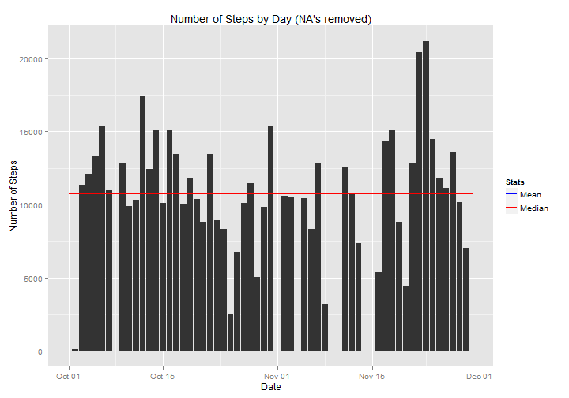
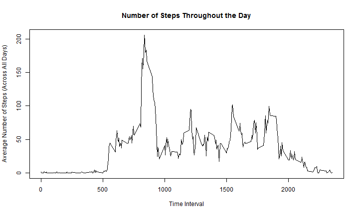
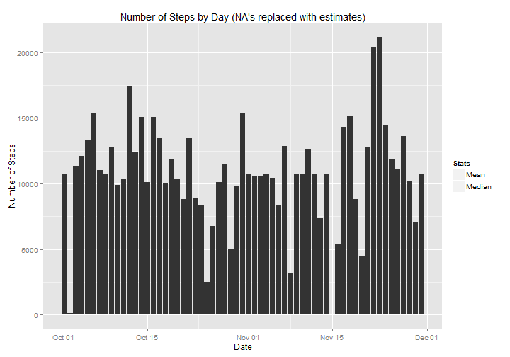
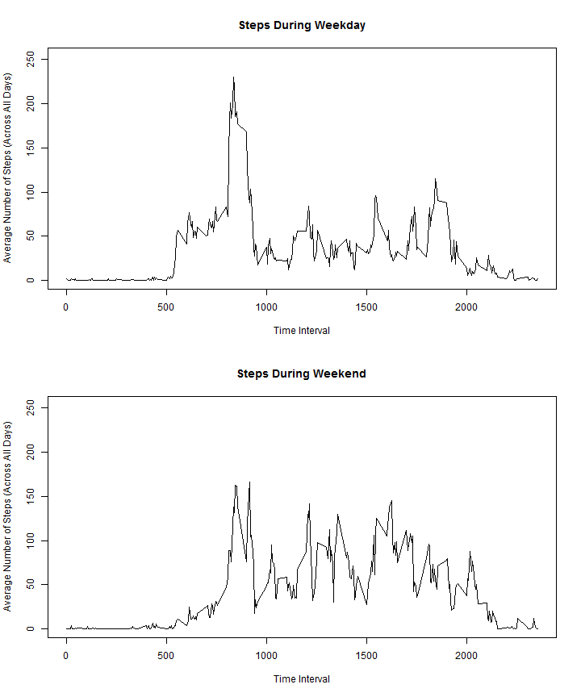

##1. Loading and Preprocessing the Data

This section deals with data preparation in general.

**Problem 1.1**

Show any Code that is needed to load the data

**Code**


```r
## Read Source Data
sourcefile <- "activity.csv"
df <- read.csv(sourcefile)
```

**Problem 1.2**

Process/transform the data (if necessary) into a format suitable for analysis


```r
# make 'date' the column in date format, move date strings to column 'dateString'
df$dateString <- df$date
df$date <- as.Date(df$dateString, format = "%Y-%m-%d")

# create a new dataframe where all NA's are dropped
ok <- complete.cases(df)
dfComplete <- df[ok, ]
```


##2. Steps by Day

We calculate how many steps the subject takes every day, over a 2-month period.

Missing values in the dataset can be ignored (as per instruction)

**Problems 2.1 and 2.2**

1. Make a histogram of the total number of steps taken each day
2. Calculate and report the mean and median total number of steps taken per day

**Code**


```r
###########################################################
##
##  Total number of steps taken per day?
##      1. Histogram of total number of steps taken each day
##      2. Calculate and report the mean and median total number of steps
##          taken per day
##
##      Ignore NA's (so we are using dfComplete, not df)

library(plyr)

#dfStepsByDate1 <- ddply(dfComplete, .(date), summarise, stepsByDay = sum(steps))
dfStepsByDate1 <- ddply(df, .(date), summarise, stepsByDay = sum(steps))

## A function to plot a histogram of total steps by day with mean and median lines

meanSteps1 <- mean(dfStepsByDate1$stepsByDay, na.rm = TRUE)
medianSteps1 <- quantile(dfStepsByDate1$stepsByDay, probs = 0.5, na.rm = TRUE)[1]
linesDf1 <- data.frame(date = dfStepsByDate1$date,
                      meanSteps = meanSteps1,
                      medianSteps = medianSteps1)

library(ggplot2)

g <- ggplot()

# bar plot ("histogram")
g <- g + geom_bar(mapping = aes(x = dfStepsByDate1$date,
                                y = dfStepsByDate1$stepsByDay),
                  stat = "identity")

# axes and title
g <- g + labs(title = "Number of Steps by Day (NA's removed)")
g <- g + labs(x = "Date", y = "Number of Steps")

# statistics lines and legend
g <- g + geom_line(data = linesDf1,
                   mapping = aes(colour = "Mean",
                                 x = linesDf1$date,
                                 y = linesDf1$meanSteps))
g <- g + geom_line(data = linesDf1,
                   mapping = aes(colour = "Median",
                                 x = linesDf1$date,
                                 y = linesDf1$medianSteps))
g <- g + scale_colour_manual(name = "Stats",
                             values = c("Median" = "red", "Mean" = "blue"))
```

**Plot and Results**


```r
plot(g)
```

 

Mean Number of Steps per Day: 1.0766189 &times; 10<sup>4</sup>.  
Median Number of Steps per Day: 1.0765 &times; 10<sup>4</sup>.

Note that Mean and Median are very close, so only one line is visible in the graph.

##3. Average Daily Activity Pattern

This section examines the number of steps throughout the day.

**Problem 3.1**:

Make a time series plot (i.e. type = "l") of the 5-minute interval (x-axis) 
and the average number of steps taken, averaged across all days (y-axis)  

**Code and Plot**:


```r
library(reshape2)
dfMelt <- melt(dfComplete, id = "interval", measure.vars = "steps")
dfStepsByTimeInterval <- dcast(dfMelt, interval ~ variable, mean)
plot(dfStepsByTimeInterval,
     type = "l",
     main = "Number of Steps Throughout the Day",
     xlab= "Time Interval",
     ylab = "Average Number of Steps (Across All Days)")
```

 


**Problem 3.2**:

Which 5-minute interval, on average across all the days 
in the dataset, contains the maximum number of steps?  

**Code**:
  

```r
indexOfMax <- which.max(dfStepsByTimeInterval$steps)
timeIntervalWithMaxSteps <- dfStepsByTimeInterval$interval[indexOfMax]
timeIntervalWithMaxSteps
```

```
## [1] 835
```

**Answer**: The time interval with the maximum average number of steps is 
835.

##4. Imputing Missing Values

Note that there are a number of days/intervals where there are missing values 
(coded as NA). The presence of missing days may introduce bias into some 
calculations or summaries of the data.

**Problem 4.1:** Total Number of rows with missing values ("NA")


```r
origRows <- nrow(df)
completeRows <- nrow(dfComplete)
naRows <- origRows - completeRows
naRows
```

```
## [1] 2304
```

**Answer:** 2304 rows out of 17568 rows have missing values ("NA")

**Problem 4.2:** Devise a strategy for filling in all of the missing values in the dataset. 
The strategy does not need to be sophisticated. For example, you could use the 
mean/median for that day, or the mean for that 5-minute interval, etc.

**Answer:** The strategy is the following:

For every point in time where steps = NA:
We replace the steps with the average number of steps 
for that same interval in time 
averaging across all days where this interval has non-NA steps.

**Code:**


```r
# a function to calculate the default value for steps, by time interval
defaultSteps <- function(interval) {
    matchedIndex <- match(interval, dfStepsByTimeInterval$interval)
    matchedSteps <- dfStepsByTimeInterval$steps[matchedIndex]
    matchedSteps
}
```


**Problem 4.3:** Create a new dataset that is equal to the original 
dataset but with the missing data filled in.


```r
# add two vectors to data frame:
# - defaultSteps: The default steps for each time interval in the data frame
# - cleanedSteps: The original steps, where NA's are replaced by the defaultSteps
df$defaultSteps <- sapply(X = df$interval, FUN = defaultSteps)
df$cleanedSteps <- df$steps
df$cleanedSteps[is.na(df$cleanedSteps)] <- df$defaultSteps

dfNew <- data.frame(steps = df$cleanedSteps, date = df$date, interval = df$interval)
```


**Problem 4.4:**

Make a histogram of the total number of steps taken each day and Calculate and report the mean and median total number of steps taken per day. Do these values differ from the estimates from the first part of the assignment? What is the impact of imputing missing data on the estimates of the total daily number of steps?


```r
# make the plot, using the data with NA's imputed ('dfNew')

# summarize steps for each date
dfStepsByDate2 <- ddply(dfNew, .(date), summarise, stepsByDay = sum(steps))

# Calculate mean and median across dates
meanSteps2 <- mean(dfStepsByDate2$stepsByDay)
medianSteps2 <- quantile(dfStepsByDate2$stepsByDay, probs = 0.5)[1]
linesDf2 <- data.frame(date = dfStepsByDate2$date,
                      meanSteps = meanSteps2,
                      medianSteps = medianSteps2)
```


```r
# Plot histogram

library(ggplot2)

g2 <- ggplot()

# bar plot ("histogram")
g2 <- g2 + geom_bar(mapping = aes(x = dfStepsByDate2$date,
                                y = dfStepsByDate2$stepsByDay),
                  stat = "identity")

# axes and title
g2 <- g2 + labs(title = "Number of Steps by Day (NA's replaced with estimates)")
g2 <- g2 + labs(x = "Date", y = "Number of Steps")

# statistics lines and legend
g2 <- g2 + geom_line(data = linesDf2,
                   mapping = aes(colour = "Mean",
                                 x = linesDf2$date,
                                 y = linesDf2$meanSteps))
g2 <- g2 + geom_line(data = linesDf2,
                   mapping = aes(colour = "Median",
                                 x = linesDf2$date,
                                 y = linesDf2$medianSteps))
g2 <- g2 + scale_colour_manual(name = "Stats",
                             values = c("Median" = "red", "Mean" = "blue"))

plot(g2)
```

 


Mean Number of Steps per Day: 1.0766189 &times; 10<sup>4</sup>.  
Median Number of Steps per Day: 1.0766189 &times; 10<sup>4</sup>.

Note that the computed values for Mean and Median are virtually identical, 
so only one line is visible in the plot.

**Comparison to Calculation that removed NA's**

Mean Number of Steps per Day (NA removed): 1.0766189 &times; 10<sup>4</sup>.  
Median Number of Steps per Day (NA removed): 1.0765 &times; 10<sup>4</sup>.

The results for "NAs removed" are very close to the results for "NAs implied".  
At least with the method chosen (steps for NAs are implied by mean of steps 
for same interval in time)

##5. Are there Differences in Activity Patterns - Weekdays vs. Weekends

**Assignment:**

Use the dataset with the filled-in missing values for this part.

1. Create a new factor variable in the dataset with two levels - "weekday" and "weekend" indicating whether a given date is a weekday or weekend day.

2. Make a panel plot containing a time series plot (i.e. type = "l") of the 5-minute interval (x-axis) and the average number of steps taken, averaged across all weekday days or weekend days (y-axis).

**Code:**


```r
isWeekday <- function(x) {
    xIsWeekday <- weekdays(as.Date(x), abbreviate = TRUE) %in% c("Mon", "Tue", "Wed", "Thu", "Fri")
    xIsWeekday
}

dfNew$isWeekday <- factor(sapply(dfNew$date, isWeekday))

dfMelt3 <- melt(dfNew, id = c("interval", "isWeekday"), measure.vars = "steps")
dfStepsByTimeInterval3 <- dcast(dfMelt3, interval + isWeekday ~ variable, mean)

weekdaySteps <- dfStepsByTimeInterval3[dfStepsByTimeInterval3$isWeekday == TRUE, ]
weekendSteps <- dfStepsByTimeInterval3[dfStepsByTimeInterval3$isWeekday == FALSE, ]
```

**Plot:**


```r
# dimensions:
# Height = 12.0 - this is 12 inches. Values: Numeric, with decimal!
# Width = 10.0 - this is 10 inches, a bit wider than the default to accommodate time series

# panel of two plots: one above the other
par(mfrow = c(2, 1))

yrange <- c(weekdaySteps$steps, weekendSteps$steps)
yplotRange <- c(0, max(yrange) * 1.1)  # give it 10% more than necessary

plot(x = weekdaySteps$interval,
     y = weekdaySteps$steps,
     type = "l",
     main = "Steps During Weekday",
     xlab= "Time Interval",
     ylab = "Average Number of Steps (Across All Days)",
     ylim = yplotRange)

plot(x = weekendSteps$interval,
     y = weekendSteps$steps,
     type = "l",
     main = "Steps During Weekend",
     xlab= "Time Interval",
     ylab = "Average Number of Steps (Across All Days)",
     ylim = yplotRange)
```

 

**Conclusion:**

There are clear differences between activity on weekends and activity on weekdays.  

Here are the differences by range of time interval:  

**500 to 800**: Weekdays have more activity, weekends have none  
**800 to 1000**: both have spikes, but weekdays spike is higher  
**1000 to 2000**: weekend activity is higher than weekend activity  
**2000+**: both have very little activity. Weekend activity last a little longer, 
and into the 2000+ interval  


